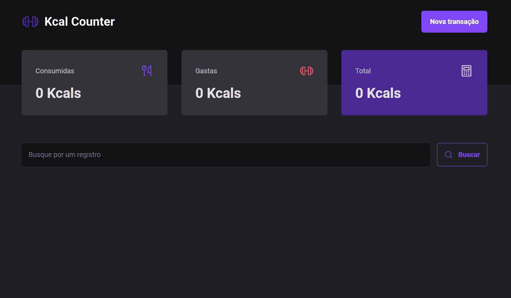

## 🏋️‍♂️ Projeto Kcal Counter

## 💻 Projeto
O projeto Kcal Counter é um controlador de calorias, contando calorias gastas por meio de atividade física ou consumidas através da alimentação.

## 🚀 Tecnologias utilizadas

<ul>
  <li>Vite</li>
  <li>Styled Components</li>
  <li>Typescript</li>
  <li>Local Storage</li>
  <li>React Router Dom</li>
  <li>Radix UI</li>
  <li>React Hook Form</li>
  <li>JSON-Server</li>
  <li>Axios</li>
</ul>
